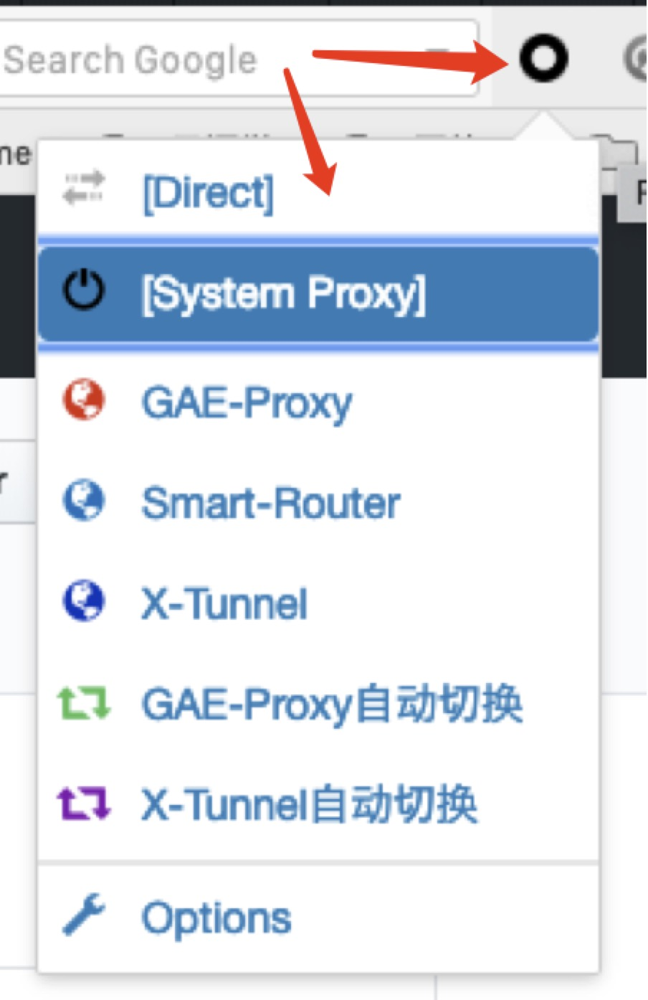
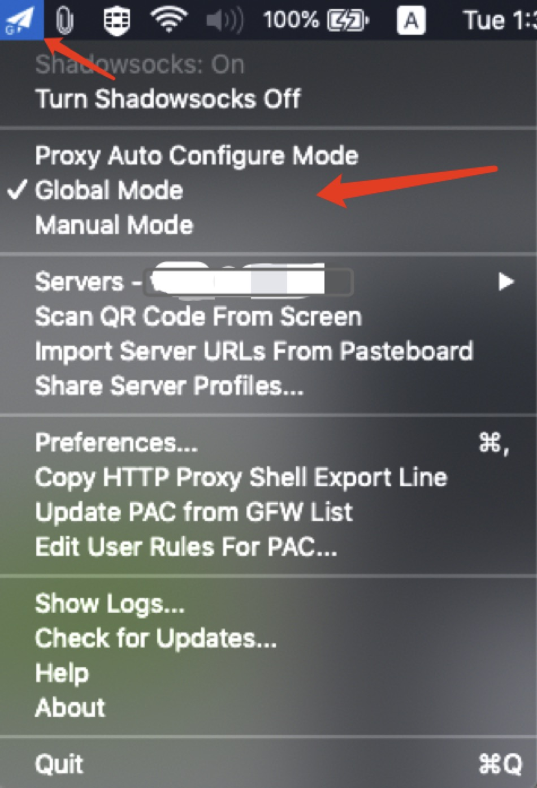
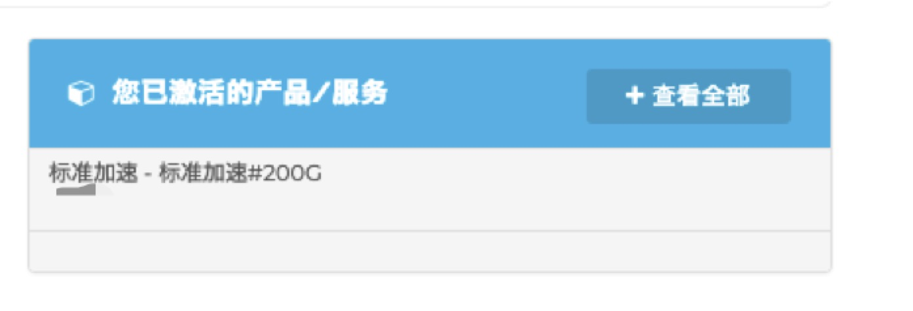
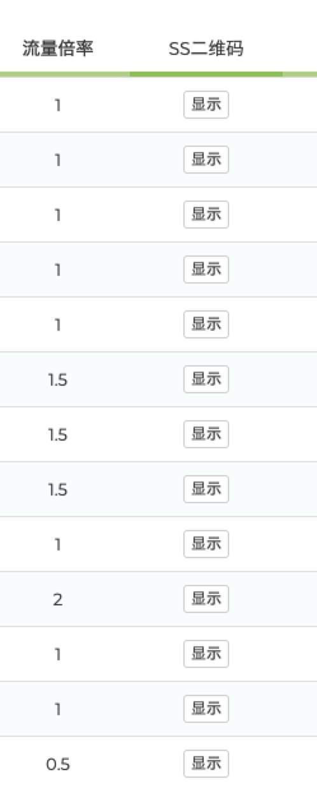
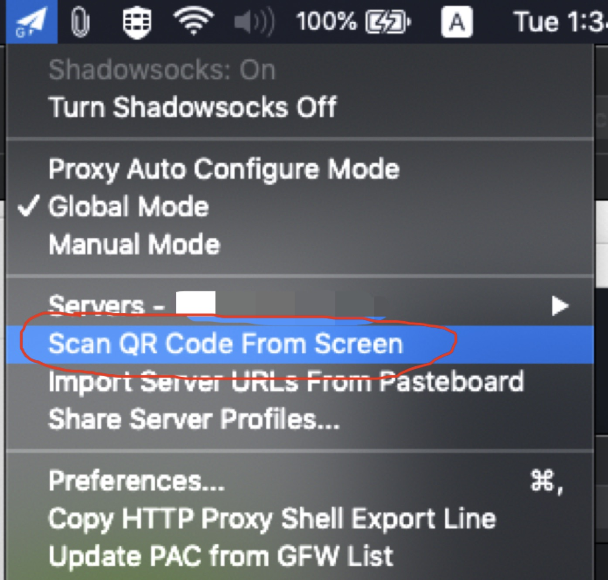
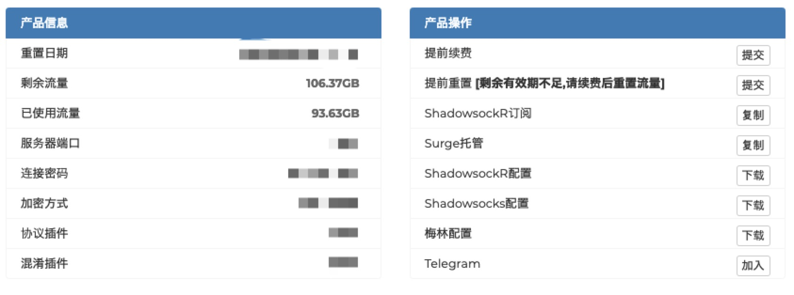

# 如何科学上网教程

安装浏览器
--------

个人推荐直接使用谷歌Chrome浏览器，但国内因为无法直接下载和访问Chrome浏览器下载链接，个人推荐[Vivaldi](https://vivaldi.com/zh-hans/)。
Vivaldi有比较好的用户体验以及颜值，同时和谷歌Chrome一样支持标签云同步，当然其核心也是chrome的，所以支持chrome的任何插件。

安装ShadowSocks连接客户端
-----------------------
1. Windows

在安装前需要确保[微软.NET Framework 4.6.2或者以上版本](https://docs.microsoft.com/zh-cn/dotnet/framework/install/index)和[微软 Visual C++ 2015 Redistributable](https://www.microsoft.com/zh-CN/download/details.aspx?id=48145) 已经安装，否则会打不开ShadowSocks Windows版。

[下载ShadowSocks Windows版](https://github.com/shadowsocks/shadowsocks-windows/releases)，把压缩包解压放到非系统盘下，或者桌面上弄个文件夹也行，因为在系统盘下此App无法写配置文件到当前目录，所以如果你录入ss节点后关掉app所有记录会消失。

2. Mac

Mac下简单很多，直接[在这里下载zip之后](https://github.com/shadowsocks/ShadowsocksX-NG/releases/)，解压安装dmg文件或者将App文件拖入应用程序(Applications)目录，双击运行后在右上角会多一个小飞机图标，就代表运行了。

* ShadowSocks 运行后会在Windows的任务栏右边或者Mac的系统菜单栏的最右边的状态栏多出一个小飞机的图标，就代表运行了。之后就是通过其中的扫码或者手动录入

SS服务购买推荐
------------

这里我推荐几个比较优秀的服务：

[RiftXX](https://portal.riftxx.com):按照流量收费， 日本香港 台湾节点Youtube快的飞起。

[CloudSS](https://go.cloudss.me):有流量和月租，日本香港也不错，但不支持Netflix

* 在上网时 当有网址提示想访问GeoLocation就是地理位置时，尽量选禁止。

SwitchyOmega安装和使用教程
------------------------

安装SwitchyOmega的步骤请参考[SwitchyOmega Wiki链接](https://github.com/FelisCatus/SwitchyOmega/wiki/GFWList).
  * 一开始会因为无法翻墙而导致无法访问谷歌商店，您也可以直接[在 Github 上下载最新版安装包](https://github.com/FelisCatus/SwitchyOmega/releases)，然后按照下载页面上的说明手动安装。
  * Chrome浏览器在地址栏输入:chrome://extensions；Vivaldi浏览器则是vivaldi://extensions。进去以后可以把上面离线版的crx安装包拖入安装就可以。
  * 注意先开Shadowsocks Windows或者NG连接ss服务后才能通过此插件翻墙。SwitchyOmega原理就是把GFWList里需要翻墙的网址通过本地的1080端口走到ShadowSocks-Windows或者Ng进行通信。

  SwitchyOmega各种模式是什么
  ------------------------

  #### 自动代理模式(Auto Proxy)：

  这个模式当你访问一个网址时，插件会查找GFWList中的列表，如果找到了说明该网址是被屏蔽需要翻墙，如果是像国内的常用网址那就直接连接不走代理，以节省代理服务器压力和流量。

  #### 全局代理模式(Global Mode):

  这个模式下将无视列表，所有的网址都会走代理，注意在此模式开启下，部分国内视频会锁区，不过像某B站部分锁区视频也可以反过来解锁。

  #### 系统代理模式:

  此模式一般会在Mac下设置，而控制全局和自动模式则是小飞机ShadowSocks NG的职责。注意玩游戏慎用ShadowSocks NG系统代理模式，因为所有App的连接都会试图走这一路。

这一些配置后就可以访问Youtube，Facebook， SoundCloud，Twitter，Discord等等的网站了。

为什么所有网站都打不开了？
----------------------

这个问题通常出在浏览器SwitchyOmega的模式选择问题：

请点击圈圈查看所选的模式

或者是ShadowSocks Mac版的模式问题：

请点击右上角小飞机查看所选的模式

或者是你的SS服务没钱没流量了

如何添加ss服务器节点到Shadowsocks客户端
-----------------------------------

假如你已经购买好了服务，以RiftXX为例，登陆后进入你的服务控制台页面：

1. 点击你所购买的服务

2. 往下拖会看到茫茫多的服务器

3. 这边点SS二维码这一列的按钮，点击在想要加的服务器所属的“显示”按钮，这样二维码就出来了

* **注意！！** 二维码内有你这个服务器的账户密码信息，请不要随意分享。
* **注意！！** 实际使用流量为：流量网页产生的流量 x 流量倍率， 一些高速服务器流量倍率是1.5或2，假设你下载了一个2G的东西，流量倍率是1.5，那么实际消耗3G的流量

回到Shadowsocks客户端，Mac和Windows端都有这个扫码添加节点的功能（Windows版在“服务器”还是“连接”的菜单上）：

4. 确保桌面上有你刚才显示的二维码没有被遮住，点击ShadowSocks的“扫码添加节点”

Mac版的Shadowsocks菜单上选择服务器后确保：Shadowsocks是On的状态。

Windows版则需要先选择服务器，然后点工具栏的第一个链接按钮

如何查看SS服务流量
---------------

假如你已经购买好了服务，以RiftXX为例，登陆后进入你的服务控制台页面：

1. 点击你所购买的服务

2. 你会在上面看到基础信息

* 如果流量用完，你可以点击右边的提前续费按钮
